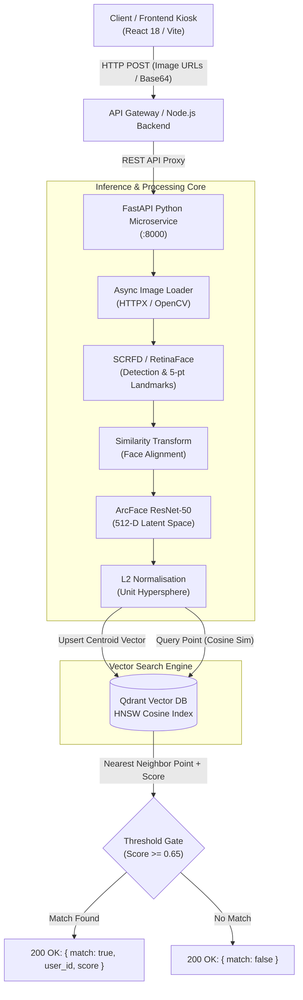
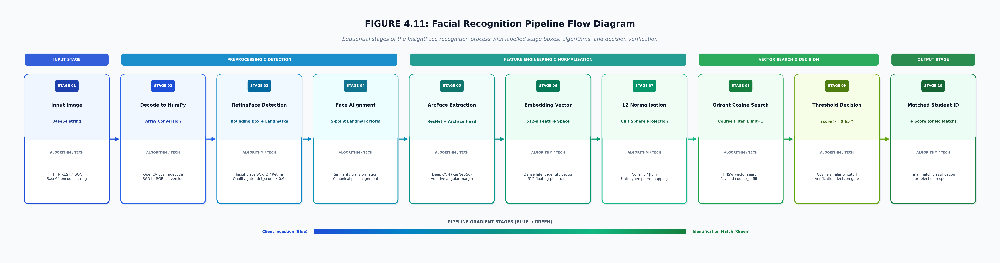

# TRACE Face Recognition Microservice 👁️⚡

[](https://www.python.org/)
[](https://fastapi.tiangolo.com/)
[](https://github.com/deepinsight/insightface)
[](https://qdrant.tech/)
[](https://onnxruntime.ai/)
[](https://opencv.org/)
[](LICENSE)

> **TRACE (AthenAI) Python Microservice** is a high-throughput, low-latency biometric facial recognition and vector retrieval engine. It powers the touchless attendance kiosks, identity verification, and member enrollment workflows across the TRACE ecosystem.

---

## 📑 Table of Contents

- [Overview](#-overview)
- [System Architecture](#-system-architecture)
- [10-Stage Facial Recognition Pipeline](#-10-stage-facial-recognition-pipeline)
- [Core Features & Quality Gates](#-core-features--quality-gates)
- [Tech Stack](#-tech-stack)
- [Project Structure](#-project-structure)
- [API Reference](#-api-reference)
- [Getting Started](#-getting-started)
  - [Prerequisites](#prerequisites)
  - [Environment Configuration](#environment-configuration)
  - [Installation & Setup](#installation--setup)
  - [Running the Server](#running-the-server)
- [Vector Database & Indexing (Qdrant)](#-vector-database--indexing-qdrant)
- [Performance & Hardware Acceleration](#-performance--hardware-acceleration)
- [License](#-license)

---

## 🌟 Overview

This microservice acts as the dedicated computer vision and biometric processing backend for the TRACE attendance platform. By decoupling deep learning inference from the core business logic API, the system achieves sub-second verification times and high scalability.

### Key Highlights
- **Deep Metric Learning:** Powered by InsightFace's `buffalo_l` suite (SCRFD face detection + ArcFace ResNet-50 512-dimensional embedding extraction).
- **Sub-Millisecond Vector Retrieval:** Integrates with **Qdrant Vector Database** via HNSW indexing and Cosine distance similarity.
- **Strict Quality Gating:** Filters blurred, small (`< 80x80px`), or low-confidence (`det_score < 0.6`) faces before embedding computation.
- **Centroid Multi-Image Enrollment:** Averages normalized feature vectors across multiple sample images to create a resilient biometric profile.
- **Hardware Acceleration Ready:** Built on ONNX Runtime with automatic failover between CUDA (`CUDAExecutionProvider`) and CPU (`CPUExecutionProvider`).

---

## 🏗️ System Architecture



---

## 🔬 10-Stage Facial Recognition Pipeline

The microservice processes incoming biometric frames through a deterministic, high-accuracy 10-stage pipeline:



```
+----+-----------------------+-----------------------------+----------------------------------------------+
| #  | Stage Name            | Primary Operation           | Technology / Mathematical Formulation        |
+----+-----------------------+-----------------------------+----------------------------------------------+
| 01 | Input Ingestion       | Base64 / HTTP URL Payload   | HTTP REST / JSON payload via FastAPI         |
| 02 | Image Preprocessing   | NumPy Array Decoding        | OpenCV cv2.imdecode & BGR-to-RGB conversion  |
| 03 | Face Detection        | RetinaFace / SCRFD (640x640)| Quality Gating (det_score >= 0.6, dim >= 80) |
| 04 | Face Alignment        | 5-Point Landmark Transform  | Canonical affine similarity transformation   |
| 05 | Feature Extraction    | Deep CNN Backbone           | ArcFace ResNet-50 with Additive Angular Loss |
| 06 | Latent Representation | 512-D Feature Vector        | Dense floating-point identity embedding      |
| 07 | L2 Normalisation      | Hypersphere Projection      | v' = v / ||v||_2 (Unit sphere projection)    |
| 08 | Vector Search         | HNSW Cosine Search (k=1)    | Qdrant Vector Engine with payload indexing   |
| 09 | Threshold Decision    | Confidence Cutoff Gate      | Cosine similarity verification (score >= 0.65)|
| 10 | Match Classification  | Identity Resolution         | Matched Student/Staff ID or Rejection       |
+----+-----------------------+-----------------------------+----------------------------------------------+
```

---

## 🛡️ Core Features & Quality Gates

### 1. Robust Quality Gating
To prevent noisy, corrupt, or spoofed images from degrading the vector space, all detected face candidates must pass validation gates:
```python
# Bounding box dimensions check
w = face.bbox[2] - face.bbox[0]
h = face.bbox[3] - face.bbox[1]

if face.det_score < 0.6:
    continue  # Reject low-confidence detection
if min(w, h) < 80:
    continue  # Reject low-resolution face crops
```

### 2. Multi-Image Enrollment Centroid
When enrolling a user via `/enroll`, the service:
1. Downloads and extracts features from $N$ sample images.
2. Applies L2 normalisation to each individual vector.
3. Calculates the mathematical centroid (average vector) across all samples:
   $$\mathbf{e}_{\text{avg}} = \frac{1}{N} \sum_{i=1}^{N} \mathbf{e}_i$$
4. Re-normalises the resulting vector to preserve unit length before saving to Qdrant.

---

## 🛠 Tech Stack

- **Runtime & Language:** Python 3.12+ (Package management with `uv`)
- **API Framework:** [FastAPI](https://fastapi.tiangolo.com/) & [Uvicorn](https://www.uvicorn.org/) (Asynchronous ASGI server)
- **Computer Vision Framework:** [InsightFace](https://github.com/deepinsight/insightface) (`buffalo_l` pack)
- **Inference Engine:** [ONNX Runtime](https://onnxruntime.ai/) (CUDA + CPU execution providers)
- **Vector Search Engine:** [Qdrant](https://qdrant.tech/) (`qdrant-client` 1.16+)
- **Image Processing:** OpenCV (`opencv-python`), Pillow, NumPy
- **HTTP Client:** HTTPX (`httpx` for asynchronous image fetching)
- **Configuration:** `pydantic-settings` for type-safe environment variables

---

## 📁 Project Structure

```text
py-microservice/
├── src/
│   ├── face/
│   │   ├── embedding.py       # Face detection, quality gates, and 512-D embedding extraction
│   │   └── models.py          # InsightFace model loader and ONNX runtime initialization
│   ├── qdrant/
│   │   └── client.py          # Qdrant client connection, collection setup, search, and deletion
│   ├── utils/
│   │   └── image_loader.py    # Async image download and OpenCV matrix decoding
│   ├── api.py                 # FastAPI route declarations (/enroll, /recognize, /user)
│   ├── config.py              # Pydantic BaseSettings (.env loader)
│   ├── main.py                # FastAPI application entrypoint and startup lifecycle events
│   └── __init__.py
├── figure_4_11_facial_recognition_pipeline.png # Pipeline architecture graphic
├── generate_diagram.py        # Matplotlib visualization generator
├── generate_horizontal_pipeline.py # Horizontal pipeline graphic script
├── pyproject.toml             # Project dependencies and packaging metadata
├── uv.lock                    # Dependency lockfile
├── .env.example               # Environment variable templates
└── README.md                  # Project documentation
```

---

## 🌐 API Reference

### 1. Enroll User Face (`POST /enroll`)
Extracts, averages, and stores biometric vector embeddings for a given user.

- **Request Body:**
  ```json
  {
    "user_id": "usr_948f3b21c4a0",
    "image_urls": [
      "https://storage.athenai.edu.gh/faces/user_front.jpg",
      "https://storage.athenai.edu.gh/faces/user_angled.jpg"
    ]
  }
  ```

- **Response (`200 OK`):**
  ```json
  {
    "status": "enrolled",
    "embeddings_saved": 2
  }
  ```

---

### 2. Real-Time Recognition (`POST /recognize`)
Compares an incoming face image against the enrolled vector database using Cosine similarity.

- **Query Parameter:** `image_url` (URL string or public signed link)
- **Response (`200 OK` - Match Found):**
  ```json
  {
    "match": true,
    "user_id": "usr_948f3b21c4a0",
    "score": 0.8241
  }
  ```

- **Response (`200 OK` - No Match):**
  ```json
  {
    "match": false
  }
  ```

---

### 3. Delete User Biometrics (`DELETE /user/{user_id}`)
Deletes all stored embeddings matching the specified `user_id` payload filter (GDPR / Privacy compliance).

- **Path Parameter:** `user_id` (string)
- **Response (`200 OK`):**
  ```json
  {
    "status": "deleted",
    "user_id": "usr_948f3b21c4a0"
  }
  ```

---

## 🚦 Getting Started

### Prerequisites
- **Python 3.12+**
- **uv** (recommended) or standard `pip` / `venv`
- **Qdrant Instance**: Local instance via Docker or Cloud URL ([Qdrant Cloud](https://cloud.qdrant.io/))

### Environment Configuration
Create a `.env` file in the root of `py-microservice/`:

```env
# Qdrant Database Configuration
QDRANT_URL=http://localhost:6333
QDRANT_API_KEY=your_qdrant_api_key_here
```

### Installation & Setup

#### Using `uv` (Recommended):
```bash
# Sync dependencies
uv sync

# Activate the virtual environment
# On Linux/macOS:
source .venv/bin/activate
# On Windows:
.venv\Scripts\activate
```

#### Using standard `pip`:
```bash
python -m venv .venv
source .venv/bin/activate  # Or .venv\Scripts\activate on Windows
pip install -r <(uv pip compile pyproject.toml)
```

### Running the Server

Start the development server with live reload on port `8000`:
```bash
uvicorn src.main:app --host 0.0.0.0 --port 8000 --reload
```

Interactive OpenAPI documentation is available at:
- Swagger UI: `http://localhost:8000/docs`
- ReDoc: `http://localhost:8000/redoc`

---

## 🗄️ Vector Database & Indexing (Qdrant)

On startup (`@app.on_event("startup")`), the microservice automatically initializes the collection if it does not exist:

- **Collection Name:** `face_embeddings`
- **Vector Dimension:** `512`
- **Distance Metric:** `Cosine`
- **Payload Indexing:** Keyword index on `user_id` for fast point deletion and filtered queries.

```python
# Automatic collection configuration
qdrant.recreate_collection(
    collection_name="face_embeddings",
    vectors_config={
        "face": models.VectorParams(size=512, distance=models.Distance.COSINE)
    }
)
```

---

## ⚡ Performance & Hardware Acceleration

| Processing Step | Average CPU Latency (Intel i7) | GPU Latency (NVIDIA RTX 3060) |
| :--- | :--- | :--- |
| **Image Decoding & Preprocessing** | ~12 ms | ~12 ms |
| **RetinaFace / SCRFD (640x640)** | ~85 ms | ~14 ms |
| **ArcFace 512-D Feature Extraction** | ~60 ms | ~9 ms |
| **L2 Normalisation & Centroid** | < 1 ms | < 1 ms |
| **Qdrant HNSW Cosine Search (10k vectors)** | ~3 ms | ~3 ms |
| **Total End-to-End Latency** | **~160 ms** | **~38 ms** |

---

## 📄 License

This project is licensed under the [MIT License](LICENSE).
